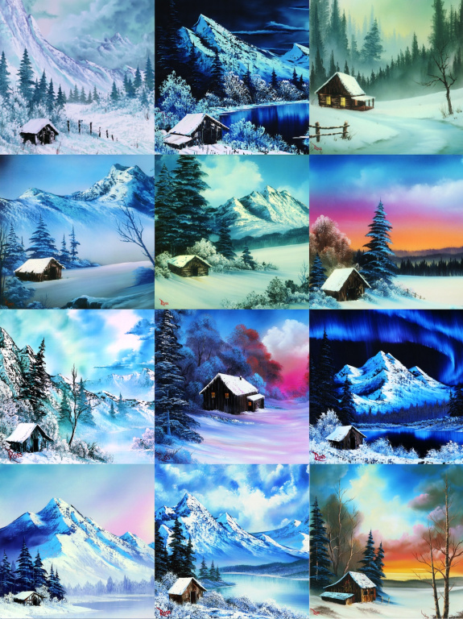

```{css, echo = FALSE}
.vis-item {
  background-color: white;
}
```


```{r setup, include = FALSE}
knitr::opts_chunk$set(
  echo = FALSE, 
  message = FALSE,
  warning = FALSE, 
  fig.align = "center", 
  fig.path = "figures/"
)
library(tidyverse)
library(lubridate)
library(timevis)
library(patchwork)

df <- read_csv("data/olddata.csv", col_types = cols(
                    .default = col_double(),
                    EPISODE = col_character(),
                    TITLE = col_character(),
                    DATE = col_date(format = "%Y-%m-%d"),
                    PAINTER = col_character())) %>% 
  mutate(SEASON = str_extract(EPISODE, "S([0-9][0-9])"),
         # clusmy way of getting rid of the 0...
         SEASON = as.character(as.numeric(str_extract(SEASON, "\\d\\d"))))

df_bob <- df %>% filter(PAINTER == "Bob Ross")
keywords <- select(df, APPLE_FRAME:WOOD_FRAMED)
n_bobross <- nrow(df_bob)
```

Bob Ross was a consummate teacher. He guided fans along as he painted “happy trees,” “almighty mountains” and “fluffy clouds” over the course of his 11-year television career on his PBS show, “The Joy of Painting.” In total, Ross painted `r n_bobross` works on the show, relying on a distinct set of elements, scenes and themes, and thereby providing thousands of data points. I decided to use that data to teach something myself: the important statistical concepts of conditional probability and clustering, as well as a lesson on the limitations of data.

You can visualise the span of each season for season 1 to 7 in Figure \@ref(fig:timevis).

```{r timevis, fig.cap = "Timeline of \"The Joy of Painting\" from Season 1-7."}
data <- df %>% 
  group_by(SEASON) %>% 
  summarise(start = min(DATE), end = max(DATE)) %>% 
  mutate(content = SEASON) %>% 
  filter(SEASON %in% 1:7)

timevis(data, showZoom = FALSE, height = "150px")
```

So let’s perm out our hair and get ready to create some happy spreadsheets!

What I found — through data analysis and an interview with one of Ross’s closest collaborators — was a body of work that was defined by consistency and a fundamentally personal ideal. Ross was born in Daytona, Fla., and joined the Air Force at 17. He was stationed in Fairbanks and spent the next 20 years in Alaska. His time there seems to have had a significant impact on his preferred subjects of trees, mountains, clouds, lakes and snow.

(ref:cabin) Paintings by Bob Ross featured on PBS’s “The Joy of Painting.” *The Bob Ross name and images are trademarks of Bob Ross Inc. All rights reserved.*

```{r cabin, fig.cap="(ref:cabin)", out.width = "90%"}

```

Of the `r nrow(df)` episodes of “The Joy of Painting” — whose first run was from `r year(min(df$DATE))` to `r year(max(df$DATE))` and which continues to air in reruns on PBS stations nationwide — Ross painted in `r n_bobross`, and the rest featured a guest, most frequently his son Steve Ross. Based on images of Bob Ross’s paintings available in the Bob Ross Inc. store, I coded all the episodes using 67 keywords describing content (trees, water, mountains, weather elements and man-made structures), stylistic choices in framing the paintings, and guest artists, for a grand total of `r scales::comma(sum(keywords))` tags.

I analyzed the data to find out exactly what Ross, who died in 1995, painted for more than a decade on TV. The top-line results are to be expected — wouldn’t you know, he did paint a bunch of mountains, trees and lakes! — but then I put some numbers to Ross’s classic figures of speech. He didn’t paint oaks or spruces, he painted “happy trees.” He favored “almighty mountains” to peaks. Once he’d painted one tree, he didn’t paint another — he painted a “friend.”

How often each tag that appeared more than five times showed up over the `r n_bobross` episodes is shown in Figure \@ref(fig:barplot).


```{r barplot, fig.height = 8, fig.cap="Percentage containing each element"}
df_longer <- df %>% 
  filter(PAINTER == "Bob Ross") %>% 
  select(APPLE_FRAME:WOOD_FRAMED) %>% 
  pivot_longer(cols = everything(), 
               names_to = "keyword",
               values_to = "tag") %>% 
  filter(tag!=0) %>% 
  group_by(keyword) %>% 
  tally() %>% 
  filter(n > 5) %>% 
  mutate(perc = round(100 * n / n_bobross),
         keyword2 = str_to_title(keyword),
         keyword2 = fct_recode(keyword2, 
                               `At least one tree` = "Tree",
                               `At least two trees` = "Trees",
                               `Deciduous tree` = "Deciduous",
                               `Coniferous tree` = "Conifer",
                               `At least one mountain` = "Mountain",
                               `River or stream` = "River",
                               `Snow-covered mountain` = "Snowy_mountain",
                               `At least two mountains` = "Mountains",
                               `Man-made structure` = "Structure",
                               `Cumulus clouds` = "Cumulus",
                               `Winter setting` = "Winter",
                               `Oval frame` = "Oval_frame",
                               `Cirrus clouds` = "Cirrus",
                               `Palm trees` = "Palm_trees"
                               ),
         keyword2 = fct_reorder(keyword2, n))

g1 <- ggplot(df_longer, aes(perc, keyword2)) + 
  geom_col(fill = "#008FD5") + 
  geom_text(aes(label = perc), hjust = -0.3, size = 3) +
  theme_void() + 
  theme(axis.text.y = element_text(size = 12, color = "black", hjust = 1),
        plot.background = element_rect(fill = "#F0F0F0", color = "transparent"),
        plot.margin = margin(10, 10, 10, 10),
        plot.title = element_text(size = 16, face = "bold", color = "black"),
        plot.subtitle = element_text(size = 14, margin = margin(b = 10, t = 5)),
        plot.title.position = "plot",
        plot.caption = element_text(size = 8, color = "black")) + 
  labs(title = "The Paintings of Bob Ross")

g2 <- ggplot() + theme_void() +  
  theme(plot.background = element_rect(fill = "#5C5E5F", color = "transparent"),
        plot.caption = element_text(size = 8, color = "white",
                                    margin = margin(t = 5, b = 5))) + 
  labs(caption = "SOURCE: THE JOY OF PAINTING")

g1 / g2 + 
  plot_layout(heights = c(90, 1))
```

```{r fns}
count_key <- function(key) { sum(df_bob[[key]]) }

perc_keys <- function(..., round = TRUE, digits = 0) {
  keys <- list(...)
  nkey <- length(keys)
  n <- nrow(df_bob)
  out <- rep(0, n)
  for(akey in keys) out <- out + df_bob[[akey]]
  if(round) return(round(sum(out == nkey) / n * 100, digits))
  sum(out == nkey) / n
}

ratio_keys <- function(cond, given) {
  num <- do.call("perc_keys", list(cond, given, round = FALSE))
  den <- do.call("perc_keys", list(given, round = FALSE))
  round(num / den * 100)
}

plural <- function(count) { ifelse(count==1, "", "s") }
```


Now that we know the basic probabilities of individual tags, we can also find the *joint probabilities* of some of these events. For instance, how often do a deciduous tree and a coniferous tree appear in the same painting? We know that `r perc_keys("DECIDUOUS")` percent of paintings contain a deciduous tree and `r perc_keys("CONIFER")` percent of paintings contain a coniferous tree. According to our data set, `r perc_keys("DECIDUOUS", "CONIFER")` percent of paintings contain at least one of each.

What’s more, we can also find the probability that Ross painted something given that he painted something else, a statistic that’s called *conditional probability*.

Conditional probability can be a bit tricky. We know that `r perc_keys("CLOUDS")` percent of Ross’s paintings contain clouds, `r perc_keys("BEACH")` percent contain the beach and `r perc_keys("BEACH", "CLOUDS")` percent contain both the clouds and the beach. We can use this information to figure out two things: the probability that Ross painted a cloud *given* that he painted a beach, and the probability that he painted a beach *given* that he painted a cloud. You divide the joint probability — `r perc_keys("BEACH", "CLOUDS")` percent in this case — by the probability of the *given* — `r perc_keys("CLOUDS")` percent or `r perc_keys("BEACH")` percent, depending on whether you want to know the probability of a beach given a cloud or a cloud given a beach.

The biggest pitfall people often face is assuming the two probabilities are the same. The probability that Ross painted a cloud given that he painted the beach — essentially, how many beach paintings have clouds — is (`r perc_keys("CLOUDS", "BEACH", digits = 2) / 100`)/(`r perc_keys("BEACH", digits = 2) / 100`), which is `r ratio_keys("CLOUDS", "BEACH")` percent. The vast majority of beach scenes contain clouds. However, the probability that Ross painted a beach given that he painted a cloud — or, how many cloud paintings contain a beach — is (`r perc_keys("BEACH", "CLOUDS", digits = 2) / 100`)/(`r perc_keys("CLOUDS", digits = 2) / 100`), or `r ratio_keys("BEACH", "CLOUDS")` percent. So the vast majority of cloud paintings don’t have beaches.

I figured out the conditional probability of every Bob Ross tag against every other tag to answer the following pressing questions.

*What is the probability, given that Ross painted a happy tree, that he then painted a friend for that tree?*

There’s a `r ratio_keys("TREES", "TREE")` percent chance that Ross paints a second tree given that he has painted a first.

*What percentage of Bob Ross paintings contain an almighty mountain?*

About `r perc_keys("MOUNTAIN")` percent prominently feature a mountain.

*What percentage of those paintings contain several almighty mountains?*

Ross was also amenable to painting friends for mountains. `r english::Words(ratio_keys("MOUNTAINS", "MOUNTAIN"))` percent of paintings with one mountain in them have at least two mountains.

*In what percentage of those paintings is a mountain covered with snow?*

Given that Ross painted a mountain, there is a `r ratio_keys("SNOWY_MOUNTAIN", "MOUNTAIN")` percent chance there is snow on it.

*What about footy little hills?*

Hills appear in `r perc_keys("HILLS")` percent of Ross’s paintings. He clearly preferred almighty mountains.

*How about happy little clouds?*

Excellent question, as `r perc_keys("CLOUDS")` percent of Ross’s paintings prominently feature at least one cloud. Given that there is a painted cloud, there’s a `r ratio_keys("CUMULUS", "CLOUDS")` percent chance it is a distinctly cumulus one. There’s only a `r ratio_keys("CIRRUS", "CLOUDS")` percent chance that a painted cloud is a distinctly cirrus one.

*What about charming little cabins?*

About `r perc_keys("CABIN")` percent of his paintings feature a cabin. Given that Ross painted a cabin, there’s a `r ratio_keys("LAKE", "CABIN")` percent chance that it’s on a lake, and a `r ratio_keys("SNOW", "CABIN")` percent chance there’s snow on the ground. While `r ratio_keys("CONIFER", "CABIN")` percent of cabins are in the same painting as conifers, only `r ratio_keys("DECIDUOUS", "CABIN")` percent are near deciduous trees.

*How often did he paint water?*

All the time! About `r perc_keys("LAKE")` percent of Ross’s paintings contain a lake, `r perc_keys("RIVER")` percent contain a river or stream, and `r perc_keys("OCEAN")` percent contain the ocean.

*Sounds like he didn’t like the beach.*

Much to the contrary. You can see the beach in `r perc_keys("BEACH")` percent of Ross’s seaside paintings, but the sun in only `r perc_keys("SUN")` percent of them. If there’s an ocean, it’s probably choppy: `r ratio_keys("WAVES", "OCEAN")` percent of ocean paintings have waves. Ross’s `r sum(df_bob$OCEAN)` ocean paintings were also more likely to feature cliffs, clouds and rocks than the average painting.

*What about Steve Ross?*

Steve seemed to prefer lakes far more than Bob. While only 34 percent of Bob’s paintings have a lake in them, 91 percent of Steve’s paintings do.


To learn more about Ross and his work beyond what I already knew from the data, I called Annette Kowalski, who founded Bob Ross Inc. with the painter and remains the steward of his work. She confirmed something I had discovered in my review of hundreds of Ross’s landscapes: His work isn’t defined by what is included in his paintings, but by what’s excluded.

“I can think of two times he painted people,” Kowalski said. “There was a man by a campfire, and two people walking through the woods.” Indeed, our data shows that Ross only painted a person — in silhouette against a tree near a campfire — one time.

When we analyze the structures he painted, it appears Ross preferred the simple to the elaborate. He painted `r count_key("CABIN")` cabin`r plural(count_key("CABIN"))`, `r count_key("FENCE")` fence`r plural(count_key("FENCE"))` in various states of disrepair and `r count_key("BARN")` barn`r plural(count_key("BARN"))`. More complex man-made structures are remarkably rare in his work. Bridges appear only `r english::words(count_key("BRIDGE"))` times. Ross painted `r english::words(count_key("DOCK"))` dock`r plural(count_key("DOCK"))`, `r english::words(count_key("LIGHTHOUSE"))` lighthouse`r plural(count_key("LIGHTHOUSE"))` and `r english::words(count_key("WINDMILL"))` windmill`r plural(count_key("WINDMILL"))` over his `r n_bobross` episodes.

There’s something about the structures Ross painted that has gone almost entirely unnoticed by fans, according to Kowalski.

“I will tell you Bob’s biggest secret. If you notice, his cabins never had chimneys on them,” she said. “That’s because chimneys represented people, and he didn’t want any sign of a person in his paintings. Check the cabins. They have no chimneys.”

She immediately added, “I’m sure you’re going to call me tomorrow and say you found a chimney.” And I did! But it took a lot of hunting. In season 7 episode 1, “Winter Cabin,” there’s a chimney on the cabin (featured above in the third row, center column). But the fact that a chimney appeared once in `r n_bobross` paintings doesn’t really diminish Kowalski’s point.

When it comes down to it, “The Joy of Painting” was never really about painting. Even Kowalski, who runs a company that sells Bob Ross-branded painting supplies, believes most viewers aren’t in it for the art.

“The majority of people who watch Bob Ross have no interest in painting,” she said. “Mostly it’s his calming voice.”
